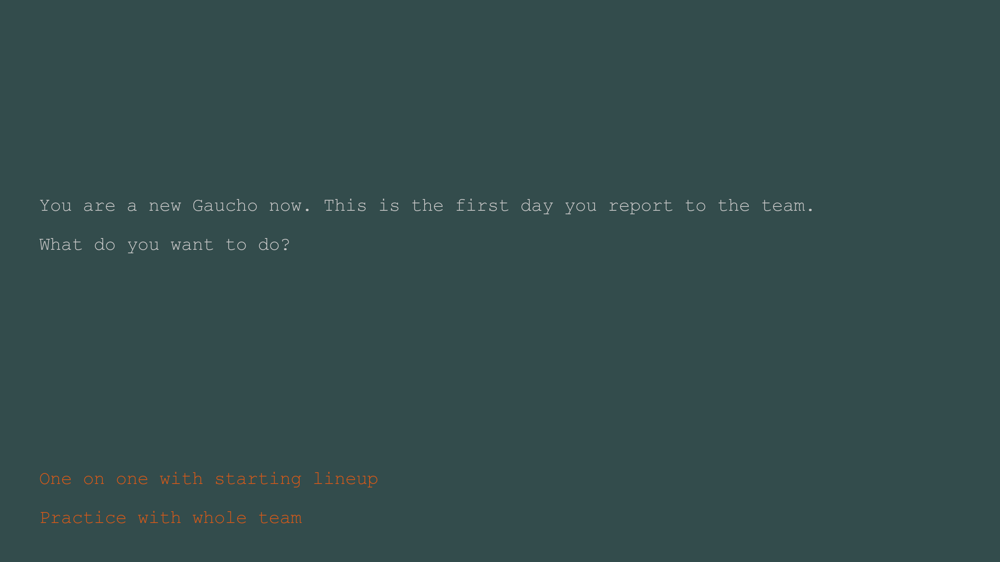

# Sim Basketball Career

Author: Zizhuo Lin

Design: Starting from an NCAA player, gain hidden points of every choice and decide which career path you will go.

Text Drawing:
The text is read from plain text file and rendered at the runtime. Use harfbuzz and freetype to create texture for each character in the string and then use the texture and glyph_info of harfbuzz to do rendering.

Screen Shot:

How To Play:
Use 1 or 2 to select your choice

This game was built with [NEST](NEST.md).

